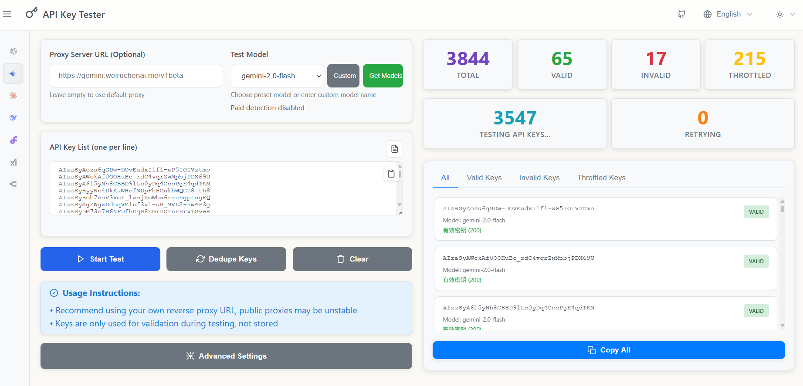

<div align="center">

# 🔑 API Key Tester
> A modern online tool for batch testing OpenAI, Claude, and Gemini API key validity

[中文](./README.md) | **English**

[](https://github.com/weiruchenai1/api-key-tester/graphs/contributors)
[](https://github.com/weiruchenai1/api-key-tester/stargazers)
[](https://github.com/weiruchenai1/api-key-tester/network/members)

[](https://github.com/weiruchenai1/api-key-tester/blob/main/LICENSE)
[](https://nodejs.org/)
[](https://github.com/weiruchenai1/api-key-tester)

[](https://weiruchenai1.github.io/api-key-tester)
[](https://vercel.com/new/clone?repository-url=https://github.com/weiruchenai1/api-key-tester)

</div>

## 📸 Preview



## ✨ Features

- 🚀 Batch test multiple API keys
- 🎯 Support for OpenAI, Claude, Gemini and other platforms
- 🔄 Smart retry mechanism for improved detection accuracy
- 🌐 Bilingual interface (Chinese/English)
- 🌙 Light/Dark theme toggle
- 📊 Real-time statistics and error details
- 📋 One-click copy for valid/invalid/rate-limited keys
- 🎛️ Support for custom model names
- ⚡ Adjustable concurrency and retry count
- 💻 Frontend-only, no installation required

## 🚀 Usage

1. Visit: **https://weiruchenai1.github.io/api-key-tester**
2. Select API type
3. Enter proxy server URL (required)
4. Paste or import (.txt) API key list
5. Use preset models or enter custom model name
6. Choose appropriate concurrency and retry count
7. Click start testing

## ⚠️ Important Notice

Due to browser CORS restrictions, a proxy server is required:

**Public Proxy Risks:**
- ⚠️ **Security Risk**: API keys may be logged by proxy servers
- 📉 **Poor Stability**: May fail or be slow at any time
- 🚫 **Usage Limits**: May have request frequency or quantity restrictions

**Strongly recommend using your own reverse proxy for better security, stability, and success rate.**

<details>
<summary>🛠️ How to Set Up Your Own Reverse Proxy</summary>

If you have your own overseas server, you can use Nginx to set up a reverse proxy:

**Prerequisites:**
- An overseas server (VPS)
- A domain with the following subdomains pointing to your server IP:
  - `openai.your-domain.com`
  - `claude.your-domain.com` 
  - `gemini.your-domain.com`

**1. Install Nginx**
```bash
sudo apt-get update
sudo apt-get install nginx
```

**2. Configure Domain and SSL Certificate**
```bash
# Apply for SSL certificate (using Let's Encrypt)
sudo apt-get install certbot python3-certbot-nginx
sudo certbot --nginx -d your-domain.com
```

**3. Create Reverse Proxy Configuration**
```bash
# Create separate configuration files for each API
sudo nano /etc/nginx/sites-available/openai-proxy
```

**4. Add OpenAI Configuration**
```nginx
# OpenAI reverse proxy
server {
    listen 443 ssl;
    server_name openai.your-domain.com;
    
    ssl_certificate /etc/letsencrypt/live/claude.your-domain.com/fullchain.pem;
    ssl_certificate_key /etc/letsencrypt/live/claude.your-domain.com/privkey.pem;
    
    location / {
        # DNS resolver, disable IPv6
        resolver 8.8.8.8 ipv6=off;
        
        # Reverse proxy configuration
        proxy_pass https://api.openai.com/;
        proxy_ssl_server_name on;
        proxy_set_header Host api.openai.com;
        proxy_set_header X-Real-IP $remote_addr;
        proxy_set_header X-Forwarded-For $proxy_add_x_forwarded_for;
        proxy_set_header X-Forwarded-Proto $scheme;
        
        # Hide backend server CORS headers to avoid duplication
        proxy_hide_header Access-Control-Allow-Origin;
        proxy_hide_header Access-Control-Allow-Methods;
        proxy_hide_header Access-Control-Allow-Headers;
        proxy_hide_header Access-Control-Allow-Credentials;
        
        # Handle OPTIONS preflight requests
        if ($request_method = 'OPTIONS') {
            add_header Access-Control-Allow-Origin *;
            add_header Access-Control-Allow-Methods 'GET, POST, PUT, DELETE, OPTIONS';
            add_header Access-Control-Allow-Headers '*';
            add_header Access-Control-Max-Age 86400;
            return 204;
        }
        
        # Add CORS headers for all other requests
        add_header Access-Control-Allow-Origin * always;
        add_header Access-Control-Allow-Methods 'GET, POST, PUT, DELETE, OPTIONS' always;
        add_header Access-Control-Allow-Headers '*' always;
    }
}
```

**5. Create Claude Configuration**
```bash
sudo nano /etc/nginx/sites-available/claude-proxy
```

Add the following content:
```nginx
# Claude reverse proxy
server {
    listen 443 ssl;
    server_name claude.your-domain.com;
    
    ssl_certificate /etc/letsencrypt/live/claude.your-domain.com/fullchain.pem;
    ssl_certificate_key /etc/letsencrypt/live/claude.your-domain.com/privkey.pem;
    
    location / {
        # DNS resolver, disable IPv6
        resolver 8.8.8.8 ipv6=off;
        
        # Reverse proxy configuration
        proxy_pass https://api.anthropic.com/;
        proxy_ssl_server_name on;
        proxy_set_header Host api.anthropic.com;
        proxy_set_header X-Real-IP $remote_addr;
        proxy_set_header X-Forwarded-For $proxy_add_x_forwarded_for;
        proxy_set_header X-Forwarded-Proto $scheme;
        
        # Hide backend server CORS headers to avoid duplication
        proxy_hide_header Access-Control-Allow-Origin;
        proxy_hide_header Access-Control-Allow-Methods;
        proxy_hide_header Access-Control-Allow-Headers;
        proxy_hide_header Access-Control-Allow-Credentials;
        
        # Handle OPTIONS preflight requests
        if ($request_method = 'OPTIONS') {
            add_header Access-Control-Allow-Origin *;
            add_header Access-Control-Allow-Methods 'GET, POST, PUT, DELETE, OPTIONS';
            add_header Access-Control-Allow-Headers '*';
            add_header Access-Control-Max-Age 86400;
            return 204;
        }
        
        # Add CORS headers for all other requests
        add_header Access-Control-Allow-Origin * always;
        add_header Access-Control-Allow-Methods 'GET, POST, PUT, DELETE, OPTIONS' always;
        add_header Access-Control-Allow-Headers '*' always;
    }
}
```

**6. Create Gemini Configuration**
```bash
sudo nano /etc/nginx/sites-available/gemini-proxy
```

Add the following content:
```nginx
# Gemini reverse proxy
server {
    listen 443 ssl;
    server_name gemini.your-domain.com;
    
    ssl_certificate /etc/letsencrypt/live/claude.your-domain.com/fullchain.pem;
    ssl_certificate_key /etc/letsencrypt/live/claude.your-domain.com/privkey.pem;
    
    location / {
        # DNS resolver, disable IPv6
        resolver 8.8.8.8 ipv6=off;
        
        # Reverse proxy configuration
        proxy_pass https://generativelanguage.googleapis.com/;
        proxy_ssl_server_name on;
        proxy_set_header Host generativelanguage.googleapis.com;
        proxy_set_header X-Real-IP $remote_addr;
        proxy_set_header X-Forwarded-For $proxy_add_x_forwarded_for;
        proxy_set_header X-Forwarded-Proto $scheme;
        
        # Hide backend server CORS headers to avoid duplication
        proxy_hide_header Access-Control-Allow-Origin;
        proxy_hide_header Access-Control-Allow-Methods;
        proxy_hide_header Access-Control-Allow-Headers;
        proxy_hide_header Access-Control-Allow-Credentials;
        
        # Handle OPTIONS preflight requests
        if ($request_method = 'OPTIONS') {
            add_header Access-Control-Allow-Origin *;
            add_header Access-Control-Allow-Methods 'GET, POST, PUT, DELETE, OPTIONS';
            add_header Access-Control-Allow-Headers '*';
            add_header Access-Control-Max-Age 86400;
            return 204;
        }
        
        # Add CORS headers for all other requests
        add_header Access-Control-Allow-Origin * always;
        add_header Access-Control-Allow-Methods 'GET, POST, PUT, DELETE, OPTIONS' always;
        add_header Access-Control-Allow-Headers '*' always;
    }
}
```

**7. Enable Configurations**
```bash
# Enable all proxy configurations
sudo ln -s /etc/nginx/sites-available/openai-proxy /etc/nginx/sites-enabled/
sudo ln -s /etc/nginx/sites-available/claude-proxy /etc/nginx/sites-enabled/
sudo ln -s /etc/nginx/sites-available/gemini-proxy /etc/nginx/sites-enabled/
```

**Configuration Notes:**
- Replace `your-domain.com` with your actual domain
- Each API uses a separate configuration file for easier management
- Certificate paths are automatically generated after applying for SSL certificates

**8. Restart Nginx**
```bash
sudo nginx -t  # Check configuration
sudo nginx -s reload  # Reload configuration
```

**Proxy URLs:**
After successful testing, use the following proxy URLs in the API Key tester:
- OpenAI: `https://openai.your-domain.com`
- Claude: `https://claude.your-domain.com`  
- Gemini: `https://gemini.your-domain.com`

</details>

## Quick Start

### Requirements

- Node.js >= 18.0.0
- npm >= 8.0.0

### Install Dependencies

```bash
npm install
```

### Start Development Server

```bash
npm run dev
```

The application will start at http://localhost:3000

### Build for Production

```bash
npm run build
```

Build artifacts will be generated in the `dist/` directory

## 🚀 Deployment Options

### 1. Docker Deployment

```bash
docker run -d \
  --name api-key-tester \
  -p 8080:80 \
  --restart unless-stopped \
  ghcr.io/weiruchenai1/api-key-tester:latest
```

Visit http://localhost:8080

### 2. Docker Compose Deployment

Using the provided docker-compose.yml file:

```bash
# Download configuration file
curl -O https://raw.githubusercontent.com/weiruchenai1/api-key-tester/main/docker-compose.yml

# Start service
docker-compose up -d

# View logs
docker-compose logs -f

# Stop service
docker-compose down
```

Custom configuration:
```yaml
services:
  web:
    image: ghcr.io/weiruchenai1/api-key-tester:latest
    ports:
      - "3000:80"  # Change port
    restart: unless-stopped
    environment:
      - TZ=Asia/Shanghai
```

### 3. Cloudflare Pages Deployment

1. Fork this repository to your GitHub account
2. Login to [Cloudflare Dashboard](https://dash.cloudflare.com/)
3. Go to `Workers & Pages` > `Create application` > `Pages` > `Connect to Git`
4. Select your forked repository
5. Configure build settings:
   - **Build command**: `npm run build`
   - **Build output directory**: `build`
   - **Node.js version**: `18` or higher
6. Click `Save and Deploy`

### 4. Vercel Deployment

**One-Click Deploy:**

[](https://vercel.com/new/clone?repository-url=https://github.com/weiruchenai1/api-key-tester&project-name=api-key-tester)

### 5. Static File Server Deployment

Suitable for any server that supports static files:

```bash
# Build project
npm run build

# Upload the contents of build directory to your web server
# Ensure server is configured with proper routing rules (SPA support)
```

**Nginx Configuration Example:**
```nginx
server {
    listen 80;
    server_name your-domain.com;
    root /path/to/build;
    index index.html;
    
    location / {
        try_files $uri $uri/ /index.html;
    }
    
    # Enable gzip compression
    gzip on;
    gzip_types text/plain text/css application/json application/javascript text/xml application/xml application/xml+rss text/javascript;
}
```

## 💡 Use Cases

- Batch API key validation
- Cleanup expired keys
- Quick key status detection
- Team key management

## 🛡️ Privacy & Security

- ✅ Pure frontend, keys are not uploaded
- ✅ Open source and transparent, code can be audited
- ✅ Only for validation, no data storage

## 🛠️ Tech Stack

Pure frontend: HTML + CSS + JavaScript

## 📄 License

MIT License

---

**If you find it useful, please give it a ⭐!**

## Star History

<a href="https://www.star-history.com/#weiruchenai1/api-key-tester&Date">
 <picture>
   <source media="(prefers-color-scheme: dark)" srcset="https://api.star-history.com/svg?repos=weiruchenai1/api-key-tester&type=Date&theme=dark" />
   <source media="(prefers-color-scheme: light)" srcset="https://api.star-history.com/svg?repos=weiruchenai1/api-key-tester&type=Date" />
   
 </picture>
</a>