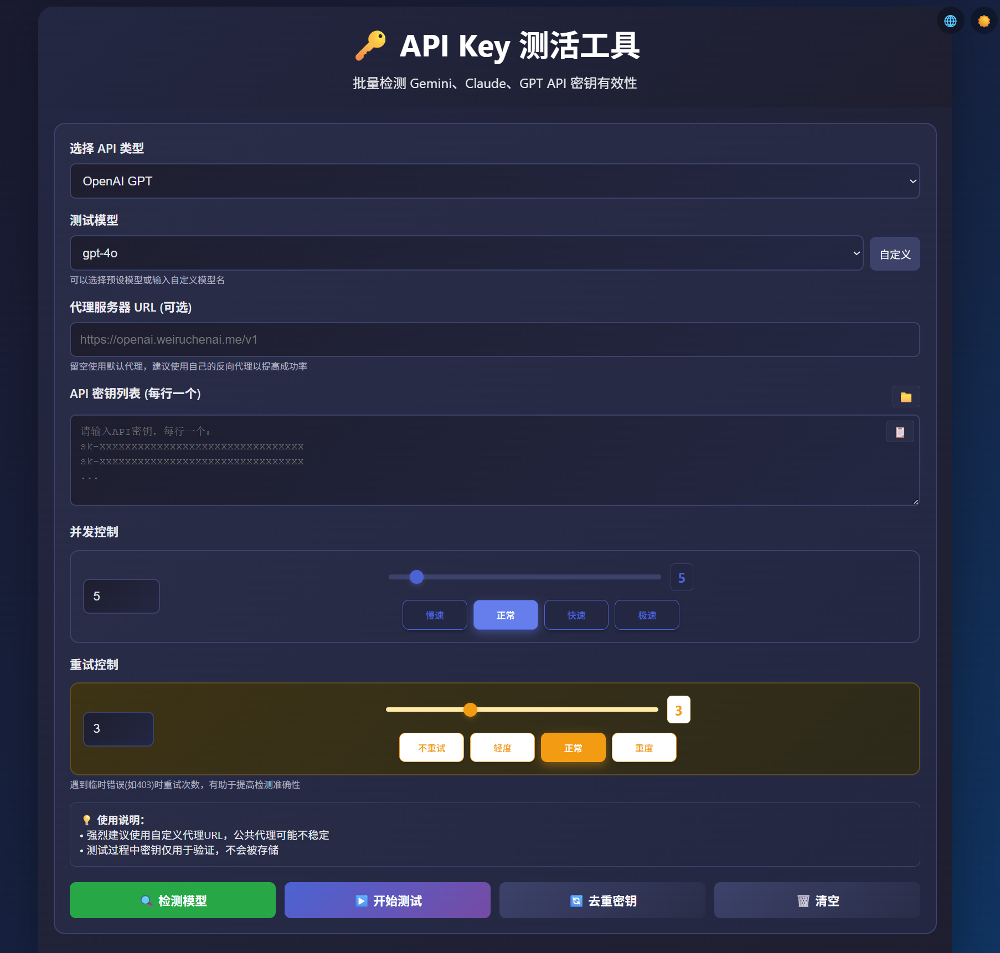

<div align="center">

# 🔑 API Key 测活工具
> 一个现代化的在线工具，批量检测 OpenAI、Claude、Gemini API 密钥有效性

**中文** | [English](./README.en.md)

[](https://github.com/weiruchenai1/api-key-tester/graphs/contributors)
[](https://github.com/weiruchenai1/api-key-tester/stargazers)
[](https://github.com/weiruchenai1/api-key-tester/network/members)

[](https://github.com/weiruchenai1/api-key-tester/blob/main/LICENSE)
[](https://nodejs.org/)
[](https://github.com/weiruchenai1/api-key-tester)

[](https://weiruchenai1.github.io/api-key-tester)
[](https://vercel.com/new/clone?repository-url=https://github.com/weiruchenai1/api-key-tester)

</div>

## 📸 预览



## ✨ 功能

- 🚀 批量测试多个 API 密钥
- 🎯 支持 OpenAI、Claude、Gemini 等平台
- 🔄 智能重试机制，提高检测准确性
- 🌐 中英文界面切换
- 🌙 浅色/深色主题切换
- 📊 实时统计和错误详情显示
- 📋 一键复制有效/无效/速率限制密钥
- 🎛️ 支持输入自定义模型名称
- ⚡ 可调节并发数和重试次数
- 💻 纯前端，无需安装

## 🚀 使用

1. 访问：**https://weiruchenai1.github.io/api-key-tester**
2. 选择 API 类型
3. 填写代理服务器 URL（必需）
4. 粘贴或者导入（.txt） API 密钥列表
5. 使用预设模型或输入自定义模型名
6. 根据需要选择合适的并发数和重试次数
7. 点击开始测试

## ⚠️ 重要提醒

由于浏览器 CORS 限制，必须使用代理服务器：

**公共代理风险提醒：**
- ⚠️ **安全风险**：API密钥可能被代理服务器记录
- 📉 **稳定性差**：可能随时失效或速度很慢
- 🚫 **使用限制**：可能有请求频率或数量限制

**强烈建议使用自己的反向代理以获得更好的安全性、稳定性和成功率。**

<details>
<summary>🛠️ 如何搭建自己的反向代理</summary>

如果你有自己的海外服务器，可以使用 Nginx 搭建反向代理：

**前置要求：**
- 一台海外服务器（VPS）
- 一个域名，并将以下子域名解析到服务器IP：
  - `openai.your-domain.com`
  - `claude.your-domain.com` 
  - `gemini.your-domain.com`

**1. 安装 Nginx**
```bash
sudo apt-get update
sudo apt-get install nginx
```

**2. 配置域名和SSL证书**
```bash
# 申请SSL证书（使用 Let's Encrypt）
sudo apt-get install certbot python3-certbot-nginx
sudo certbot --nginx -d your-domain.com
```

**3. 创建反向代理配置**
```bash
# 为每个API创建单独的配置文件
sudo nano /etc/nginx/sites-available/openai-proxy
```

**4. 添加OpenAI配置内容**
```nginx
# OpenAI 反向代理
server {
    listen 443 ssl;
    server_name openai.your-domain.com;
    
    ssl_certificate /etc/letsencrypt/live/claude.your-domain.com/fullchain.pem;
    ssl_certificate_key /etc/letsencrypt/live/claude.your-domain.com/privkey.pem;
    
    location / {
        # DNS解析器，禁用IPv6
        resolver 8.8.8.8 ipv6=off;
        
        # 反向代理配置
        proxy_pass https://api.openai.com/;
        proxy_ssl_server_name on;
        proxy_set_header Host api.openai.com;
        proxy_set_header X-Real-IP $remote_addr;
        proxy_set_header X-Forwarded-For $proxy_add_x_forwarded_for;
        proxy_set_header X-Forwarded-Proto $scheme;
        
        # 隐藏后端服务器的CORS头，避免重复
        proxy_hide_header Access-Control-Allow-Origin;
        proxy_hide_header Access-Control-Allow-Methods;
        proxy_hide_header Access-Control-Allow-Headers;
        proxy_hide_header Access-Control-Allow-Credentials;
        
        # 处理OPTIONS预检请求
        if ($request_method = 'OPTIONS') {
            add_header Access-Control-Allow-Origin *;
            add_header Access-Control-Allow-Methods 'GET, POST, PUT, DELETE, OPTIONS';
            add_header Access-Control-Allow-Headers '*';
            add_header Access-Control-Max-Age 86400;
            return 204;
        }
        
        # 为所有其他请求添加CORS头
        add_header Access-Control-Allow-Origin * always;
        add_header Access-Control-Allow-Methods 'GET, POST, PUT, DELETE, OPTIONS' always;
        add_header Access-Control-Allow-Headers '*' always;
    }
}
```

**5. 创建Claude配置**
```bash
sudo nano /etc/nginx/sites-available/claude-proxy
```

添加以下内容：
```nginx
# Claude 反向代理
server {
    listen 443 ssl;
    server_name claude.your-domain.com;
    
    ssl_certificate /etc/letsencrypt/live/claude.your-domain.com/fullchain.pem;
    ssl_certificate_key /etc/letsencrypt/live/claude.your-domain.com/privkey.pem;
    
    location / {
        # DNS解析器，禁用IPv6
        resolver 8.8.8.8 ipv6=off;
        
        # 反向代理配置
        proxy_pass https://api.anthropic.com/;
        proxy_ssl_server_name on;
        proxy_set_header Host api.anthropic.com;
        proxy_set_header X-Real-IP $remote_addr;
        proxy_set_header X-Forwarded-For $proxy_add_x_forwarded_for;
        proxy_set_header X-Forwarded-Proto $scheme;
        
        # 隐藏后端服务器的CORS头，避免重复
        proxy_hide_header Access-Control-Allow-Origin;
        proxy_hide_header Access-Control-Allow-Methods;
        proxy_hide_header Access-Control-Allow-Headers;
        proxy_hide_header Access-Control-Allow-Credentials;
        
        # 处理OPTIONS预检请求
        if ($request_method = 'OPTIONS') {
            add_header Access-Control-Allow-Origin *;
            add_header Access-Control-Allow-Methods 'GET, POST, PUT, DELETE, OPTIONS';
            add_header Access-Control-Allow-Headers '*';
            add_header Access-Control-Max-Age 86400;
            return 204;
        }
        
        # 为所有其他请求添加CORS头
        add_header Access-Control-Allow-Origin * always;
        add_header Access-Control-Allow-Methods 'GET, POST, PUT, DELETE, OPTIONS' always;
        add_header Access-Control-Allow-Headers '*' always;
    }
}
```

**6. 创建Gemini配置**
```bash
sudo nano /etc/nginx/sites-available/gemini-proxy
```

添加以下内容：
```nginx
# Gemini 反向代理
server {
    listen 443 ssl;
    server_name gemini.your-domain.com;
    
    ssl_certificate /etc/letsencrypt/live/claude.your-domain.com/fullchain.pem;
    ssl_certificate_key /etc/letsencrypt/live/claude.your-domain.com/privkey.pem;
    
    location / {
        # DNS解析器，禁用IPv6
        resolver 8.8.8.8 ipv6=off;
        
        # 反向代理配置
        proxy_pass https://generativelanguage.googleapis.com/;
        proxy_ssl_server_name on;
        proxy_set_header Host generativelanguage.googleapis.com;
        proxy_set_header X-Real-IP $remote_addr;
        proxy_set_header X-Forwarded-For $proxy_add_x_forwarded_for;
        proxy_set_header X-Forwarded-Proto $scheme;
        
        # 隐藏后端服务器的CORS头，避免重复
        proxy_hide_header Access-Control-Allow-Origin;
        proxy_hide_header Access-Control-Allow-Methods;
        proxy_hide_header Access-Control-Allow-Headers;
        proxy_hide_header Access-Control-Allow-Credentials;
        
        # 处理OPTIONS预检请求
        if ($request_method = 'OPTIONS') {
            add_header Access-Control-Allow-Origin *;
            add_header Access-Control-Allow-Methods 'GET, POST, PUT, DELETE, OPTIONS';
            add_header Access-Control-Allow-Headers '*';
            add_header Access-Control-Max-Age 86400;
            return 204;
        }
        
        # 为所有其他请求添加CORS头
        add_header Access-Control-Allow-Origin * always;
        add_header Access-Control-Allow-Methods 'GET, POST, PUT, DELETE, OPTIONS' always;
        add_header Access-Control-Allow-Headers '*' always;
    }
}
```

**7. 启用配置**
```bash
# 启用所有代理配置
sudo ln -s /etc/nginx/sites-available/openai-proxy /etc/nginx/sites-enabled/
sudo ln -s /etc/nginx/sites-available/claude-proxy /etc/nginx/sites-enabled/
sudo ln -s /etc/nginx/sites-available/gemini-proxy /etc/nginx/sites-enabled/
```

**配置说明：**
- 将 `your-domain.com` 替换为你的实际域名
- 每个API使用单独的配置文件，便于管理
- 证书路径会在申请SSL证书后自动生成，无需手动修改

**8. 重启 Nginx**
```bash
sudo nginx -t  # 检查配置
sudo nginx -s reload  # 重新加载配置
```

**代理地址：**
测试成功后，在API Key测试工具中使用以下代理地址：
- OpenAI: `https://openai.your-domain.com/v1`
- Claude: `https://claude.your-domain.com/v1`  
- Gemini: `https://gemini.your-domain.com/v1`

</details>

## 快速开始

### 环境要求

- Node.js >= 20.19.0
- npm >= 8.0.0

### 安装依赖

```bash
npm install
```

### 启动开发服务器

```bash
npm run dev
```

应用将在 http://localhost:3000 启动

### 构建生产版本

```bash
npm run build
```

构建产物将生成到 `dist/` 目录

## 🚀 部署方式

### 1. Docker 部署

```bash
docker run -d \
  --name api-key-tester \
  -p 8080:80 \
  --restart unless-stopped \
  ghcr.io/weiruchenai1/api-key-tester:latest
```

访问 http://localhost:8080

### 2. Docker Compose 部署

使用提供的 docker-compose.yml 文件：

```bash
# 下载配置文件
curl -O https://raw.githubusercontent.com/weiruchenai1/api-key-tester/main/docker-compose.yml

# 启动服务
docker-compose up -d

# 查看日志
docker-compose logs -f

# 停止服务
docker-compose down
```

自定义配置：
```yaml
services:
  web:
    image: ghcr.io/weiruchenai1/api-key-tester:latest
    ports:
      - "3000:80"  # 修改端口
    restart: unless-stopped
    environment:
      - TZ=Asia/Shanghai
```

### 3. Cloudflare Pages 部署

1. Fork 此仓库到你的 GitHub 账户
2. 登录 [Cloudflare Dashboard](https://dash.cloudflare.com/)
3. 进入 `Workers & Pages` > `Create application` > `Pages` > `Connect to Git`
4. 选择你 Fork 的仓库
5. 配置构建设置：
   - **构建命令**: `npm run build`
   - **构建输出目录**: `dist`
   - **Node.js 版本**: `20` 或更高
6. 点击 `Save and Deploy`

### 4. Vercel 部署

**一键部署：**

[](https://vercel.com/new/clone?repository-url=https://github.com/weiruchenai1/api-key-tester&project-name=api-key-tester)

### 5. 静态文件服务器部署

适用于任何支持静态文件的服务器：

```bash
# 构建项目
npm run build

# 将 dist 目录的内容上传到你的 Web 服务器
# 确保服务器配置了正确的路由规则（SPA 支持）
```

**Nginx 配置示例：**
```nginx
server {
    listen 80;
    server_name your-domain.com;
    root /path/to/dist;
    index index.html;
    
    location / {
        try_files $uri $uri/ /index.html;
    }
    
    # 启用 gzip 压缩
    gzip on;
    gzip_types text/plain text/css application/json application/javascript text/xml application/xml application/xml+rss text/javascript;
}
```

## 💡 适用场景

- API 密钥批量验证
- 清理过期的密钥
- 快速检测密钥状态
- 团队密钥管理

## 🛡️ 隐私安全

- ✅ 纯前端运行，密钥不会上传
- ✅ 开源透明，代码可审查
- ✅ 仅用于验证，不存储任何数据

## 🛠️ 技术栈

- **前端框架**: React 19
- **构建工具**: Vite 7

## 📄 许可证

MIT License

---

**如果有用的话，给个 ⭐ 吧！**

## Star History

<a href="https://www.star-history.com/#weiruchenai1/api-key-tester&Date">
 <picture>
   <source media="(prefers-color-scheme: dark)" srcset="https://api.star-history.com/svg?repos=weiruchenai1/api-key-tester&type=Date&theme=dark" />
   <source media="(prefers-color-scheme: light)" srcset="https://api.star-history.com/svg?repos=weiruchenai1/api-key-tester&type=Date" />
   
 </picture>
</a>