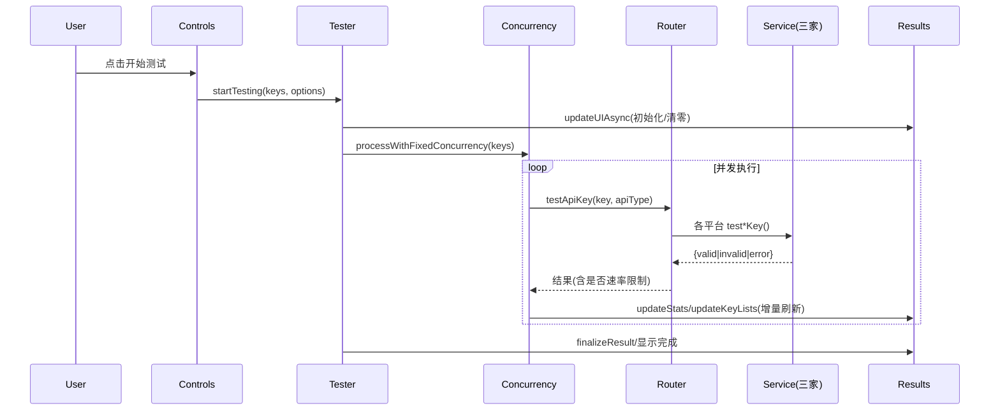
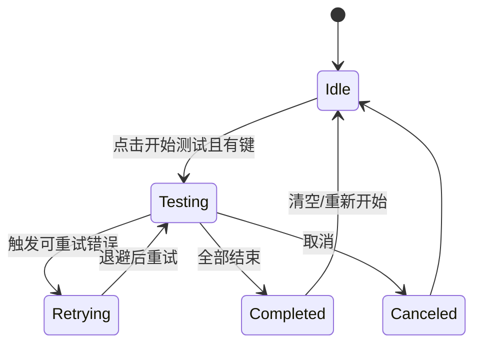

## 拆分重构计划（Refactor Plan）

### 一、背景与目标
- 将单文件 `index.html`（含 HTML/CSS/JS）逐步拆分为清晰的模块与层次，降低耦合、提升可维护性与测试性。
- 在不改变部署形态（可直接打开 `index.html` 或 GitHub Pages）的前提下，逐步完成服务层、核心流程、UI 层、工具、国际化、主题与样式的拆分。
- 为“Gemini 付费检测”等后续需求留出扩展点，提升整体工程质量（覆盖率、CI 兼容、团队协作）。

### 二、范围与不在范围
- 范围：前端页面逻辑、服务适配层、并发与重试、UI 渲染与控件、国际化与主题、工具方法、样式分层、测试与覆盖率、推送与忽略策略。
- 不在范围：后端/代理实现、业务需求新增（除计划中的“付费检测”扩展）。

### 三、总体原则
- 单一职责：按 UI、核心流程、并发/重试、服务、工具、国际化、主题、样式等分层。
- 渐进替换：每步仅抽取一小块功能到独立文件；抽取后即修改 `index.html` 引用并做回归。
- 可回滚：每步完成后页面可运行，出现异常快速撤销当前步修改。
- 可测试：优先抽取“纯逻辑/少 DOM 依赖”的部分，尽可能为每步补充单测/Mock。

### 四、目标结构
```text
api-key-tester/
├─ index.html
├─ js/
│  ├─ app/
│  │  └─ bootstrap.js           # 初始化与事件绑定（入口）
│  ├─ core/
│  │  ├─ tester.js              # startTesting / finalizeResult / 取消逻辑
│  │  ├─ concurrency.js         # processWithFixedConcurrency / updateProgress 等
│  │  └─ retry.js               # testApiKeyWithRetry / shouldRetry / extractStatusCode
│  ├─ services/
│  │  ├─ apiUrl.js              # getApiUrl / updateProxyPlaceholder
│  │  ├─ openaiService.js       # testOpenAIKey / getOpenAIModels
│  │  ├─ claudeService.js       # testClaudeKey / getClaudeModels
│  │  ├─ geminiService.js       # testGeminiKey / getGeminiModels / (Step11: testGeminiContextCaching)
│  │  ├─ modelsService.js       # getAvailableModels
│  │  └─ router.js              # testApiKey 调度到三家 Service
│  ├─ ui/
│  │  ├─ controls.js            # 并发/重试/模型等控件初始化与交互
│  │  ├─ results.js             # updateStats/updateKeyLists/showTab/updateUIAsync/updateStartButtonText
│  │  ├─ models.js              # 模型选择区 UI
│  │  └─ theme.js               # toggleTheme
│  ├─ i18n/
│  │  ├─ translations.js        # 文案表
│  │  └─ i18n.js                # updateLanguage / toggleLanguage / getLocalizedError
│  ├─ utils/
│  │  ├─ keys.js                # deduplicateAndCleanKeys / extractApiKeys 等
│  │  └─ clipboard.js           # copyKeys / pasteFromClipboard / importFile
│  └─ config/
│     └─ modelOptions.js        # 各平台模型常量
├─ css/
│  ├─ base.css                  # 基础/浅色主题样式
│  └─ theme.css                 # 深色主题覆写
├─ tests/
│  └─ unit/                     # Vitest 单测
│     ├─ cssExternalization.test.js  # 样式外链校验
│     ├─ uiParity.test.js            # 原版/现版 UI 等价性
│     └─ 其他 * .test.js
├─ docs/
│  └─ refactor-plan.md
├─ package.json
├─ vitest.config.js
├─ README.md
└─ LICENSE
```

### 五、迁移映射（自 `index.html` → 模块文件）
- core：`startTesting/finalizeResult` → `js/core/tester.js`；`processWithFixedConcurrency/updateProgress` → `js/core/concurrency.js`；`testApiKeyWithRetry/shouldRetry/extractStatusCode` → `js/core/retry.js`
- services：`getApiUrl/updateProxyPlaceholder` → `js/services/apiUrl.js`；各平台 `get*Models/test*Key` → 对应 `*Service.js`；`testApiKey` 调度 → `js/services/router.js`
- ui：`updateStats/updateKeyLists/updateKeyList/showTab/updateUIAsync/updateStartButtonText` → `js/ui/results.js`；并发/重试/模型控件 → `js/ui/controls.js`；模型区 UI → `js/ui/models.js`
- i18n/theme：文案表 `translations` → `js/i18n/translations.js`；`updateLanguage/toggleLanguage/getLocalizedError` → `js/i18n/i18n.js`；`toggleTheme` → `js/ui/theme.js`
- utils：`deduplicateAndCleanKeys/extractApiKeys/extractKeysFromContent/cleanApiKey` → `js/utils/keys.js`；`copyKeys/pasteFromClipboard/importFile/handleFileSelect` → `js/utils/clipboard.js`
- app 入口：`initialize/bind events` → `js/app/bootstrap.js`
- config：`modelOptions` → `js/config/modelOptions.js`
- css：从内联样式抽取到 `css/base.css` 与 `css/theme.css`（已移除内联大段 `<style>`，仅保留占位注释）

### 六、分步计划（Step 0~12）
- Step 0 预备
  - 动作：创建 `js/ css/ tests/` 等目录；在 `index.html` 预留外链位置
  - 验收：页面可开、无 404/报错
- Step 1 services/apiUrl
  - 动作：抽取 `getApiUrl/updateProxyPlaceholder` → `js/services/apiUrl.js`
  - 验收：切换 API 类型时占位符更新；默认代理逻辑正常
- Step 2 平台服务
  - 动作：抽取 OpenAI/Claude/Gemini 的 `get*Models/test*Key` → `js/services/*Service.js`
  - 验收：三平台“检测模型/开始测试”可用
- Step 3 重试策略
  - 动作：抽取 `testApiKeyWithRetry/shouldRetry/extractStatusCode` → `js/core/retry.js`
  - 验收：403/502/503/504、网络/超时关键词触发重试；速率限制直接返回
- Step 4 并发执行
  - 动作：抽取 `processWithFixedConcurrency/startKeyTest/waitForAnySlotCompletion/updateProgress` → `js/core/concurrency.js`
  - 验收：并发/进度表现与拆分前一致；取消能尽快停止排队
- Step 5 测试编排
  - 动作：抽取 `startTesting/finalizeResult` → `js/core/tester.js`
  - 验收：整条流程（去重→初始化→并发→收尾提示）跑通
- Step 6 工具
  - 动作：抽取 `utils/keys.js` 与 `utils/clipboard.js`
  - 验收：导入/粘贴/复制/去重功能完好
- Step 7 UI 渲染与控件
  - 动作：抽取 `ui/render.js` 与 `ui/controls.js`
  - 验收：统计卡、列表、标签切换、控件联动均正常
- Step 8 国际化与主题
  - 动作：抽取 `i18n.js` 与 `theme.js`
  - 验收：中英切换、明暗主题切换均可用
- Step 9 入口与事件
  - 动作：抽取 `main.js`
  - 验收：页面加载后所有事件与控件生效，无报错
- Step 10 样式分层
  - 动作：新建 `css/base.css`、`css/theme.css` 并迁移样式，清理重复 `.dark-theme` 规则；`index.html` 仅保留占位注释
  - 验收：浅/深主题、移动端适配正常；无视觉回归；通过 `cssExternalization.test.js`
- Step 11 付费检测
  - 动作：在 `geminiService.js` 增加 `testGeminiContextCaching`；结果在 `finalizeResult` 中区分 `paid`
  - 验收：选择 Gemini 时出现“付费”维度并正确分类
- Step 12 安全与性能
  - 动作：CSP、AbortController、缓存策略
  - 验收：严格 CSP 下运行正常；取消测试可中止在途请求

### 七、质量保障与测试策略
- 工具：Vitest + jsdom（单测），后续可加 Playwright（E2E）
- Mock：拦截 `fetch`，覆盖 200/4xx/5xx/网络错误/超时与边界
- 回归保障：
  - `tests/unit/uiParity.test.js` 对比原版/现版的 id 与 data-lang-key、Tab/预设/复制按钮集合等
  - `tests/unit/cssExternalization.test.js` 校验 `<style>` 占位注释与外链 CSS
- 覆盖率：
  - 目标：关键分支 ≥ 80%，整体语句/函数/行 ≥ 90%

### 八、阶段性进度
- 已完成：Step 1~10（服务、核心、工具、UI、i18n、主题、入口、样式外链）；修复多处 UI 细节并补足测试
- 新增文件：`js/services/router.js`、`js/config/modelOptions.js`、`js/ui/results.js`、`js/app/bootstrap.js`
- 新增单测：`uiParity.test.js`、`cssExternalization.test.js`

### 九、UML 视图（Mermaid）

#### 9.1 模块/依赖图
```mermaid
graph LR
  subgraph App[App & Entry]
    BOOT[js/app/bootstrap.js]
  end

  subgraph UI[UI Layer]
    CTRL[js/ui/controls.js]
    RES[js/ui/results.js]
    MODELS[js/ui/models.js]
    THEME[js/ui/theme.js]
  end

  subgraph Core[Core]
    TEST[js/core/tester.js]
    CONC[js/core/concurrency.js]
    RETRY[js/core/retry.js]
  end

  subgraph Services[Services]
    ROUTER[js/services/router.js]
    OA[js/services/openaiService.js]
    CL[js/services/claudeService.js]
    GM[js/services/geminiService.js]
    MS[js/services/modelsService.js]
    API[js/services/apiUrl.js]
  end

  subgraph I18N[I18N]
    TR[js/i18n/translations.js]
    I18N[js/i18n/i18n.js]
  end

  subgraph Utils[Utils]
    KEYS[js/utils/keys.js]
    CB[js/utils/clipboard.js]
  end

  subgraph CSS[CSS]
    BASE[css/base.css]
    THEME_CSS[css/theme.css]
  end

  BOOT --> CTRL
  BOOT --> MODELS
  BOOT --> THEME
  CTRL --> TEST
  MODELS --> MS
  TEST --> CONC
  CONC --> RETRY
  CONC --> ROUTER
  ROUTER --> OA
  ROUTER --> CL
  ROUTER --> GM
  TEST --> RES
  CONC --> RES
  RES --> I18N
  CTRL --> I18N
  CTRL --> KEYS
  CTRL --> CB
  API -. 提供端点 .- ROUTER
  BASE -. 样式 .- UI
  THEME_CSS -. 深色覆写 .- UI
```

#### 9.2 核心流程时序图（开始测试）


#### 9.3 重试活动图
```mermaid
flowchart TD
  A[收到结果/异常] -->|有效/无效| END1[返回结果]
  A -->|可重试条件: 5xx/网络/超时/403(临时)| B{是否超过最大重试}
  B -- 是 --> END2[返回最终失败]
  B -- 否 --> C[指数退避等待]
  C --> D[再次调用 Service]
  D --> A
```

#### 9.4 UI 状态机



> 本计划为对外共享文档，可作为团队协作、代码评审与进度跟踪的依据；如需，我可在 CI 中接入 Lint/Test/Build 流程，确保主干质量稳定。
